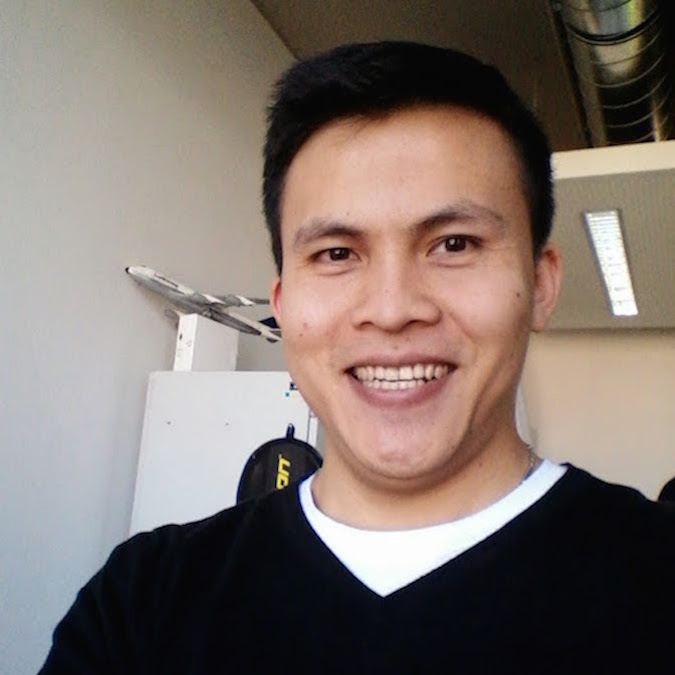

 ---
layout: default
---

# Le Quoc Do 
Ph.D. Student, Computer Science  
TU Dresden, Germany  

<!-- <em>Curriculum Vitae: </em><a href="/files/CV_new.pdf" target="_blank">PDF</a>  <small>(September, 2017)</small>   -->
<em>Git repository: </em> 
<em>Email: </em><a href="mailto:do.le_quoc@tu-dresden.de">do.le_quoc@tu-dresden.de</a>  
<em>Office: </em>Systems Engineering Chair, APB 3074 

<!-- 
 -->
-----

## About Me
<!--  -->

<!-- 
 -->

I'm a Ph.D. student at the Systems Engineering Group of TU Dresden co-supervised by <a href="https://tu-dresden.de/ing/informatik/sya/se/die-professur/inhaber-in" target="_blank"> Prof. Dr. Christof Fetzer</a> and <a href="http://homepages.inf.ed.ac.uk/pbhatoti" target="_blank"> Prof. Dr. Pramod Bhatotia</a>. My research interests include big data analytics, approximate computing, and distributed systems. During my Ph.D., I’ve been lucky to have fruitful internship/collaboration with <a href="https://www.bell-labs.com/">Bell Labs</a>.

Prior to joining TU Dresden, I received my master degree in computer science from Pohang University of Science and Technology (POSTECH), Korea in 2012 under the supervision of <a href="http://dpnm.postech.ac.kr/~jwkhong/" target="_blank">Prof. Dr. James Won-Ki Hong</a>. I also worked at R&D center of DASAN Networks company, Seoul, Korea after receiving the master degree.

<!-- ## Research Interests

 -->

-----

## Selected Publications

- **StreamApprox: Approximate Computing for Stream Analytics**, _Do Le Quoc_, Ruichuan Chen, Pramod Bhatotia, Christof Fetzer, Volker Hilt, and Thorsten Strufe, in 17th International Middleware Conference (<em><a class="tosu">Middleware</a>), Las Vegas, Nevada, USA, 2017. <small><a>(This work also has been presented at Flink Forward'17 and Spark Summit Europe'17)</a></small>. 

- **PrivApprox: Privacy-Preserving Stream Analytics**, _Do Le Quoc_, Martin Beck,  Pramod Bhatotia,  Ruichuan Chen, Christof Fetzer, and Thorsten Strufe, in the USENIX Annual Technical Conference (<em><a class="tosu">USENIX ATC</a>), Santa Clara, CA, USA, 2017.

- **IncApprox: A Data Analytics System for Incremental Approximate Computing**, Dhanya R Krishnan, _Do Le Quoc_, Pramod Bhatotia, Christof Fetzer, and Rodrigo Rodrigue, in the 25rd International World Wide Web Conference (<em><a class="tosu">WWW</a>), Montreal, Canada, 2016.

- **UniCrawl: A Practical Geographically Distributed Web Crawlers**, _Do Le Quoc_, Christof Fetzer, Pascal Felber,
    Étienne Rivière, Valerio Schiavoni, Pierre Sutra, in the 8th IEEE International Conference on Cloud Computing (<em><a class="tosu">CLOUD</a>), New York, USA, 2015.

<!-- -----

## News

<table style="white-space: nowrap;">
	<tr>
	<td width="75"><b>Sep, 17'</b></td>
	<td>Giving a talk at <a href="https://berlin.flink-forward.org" target="_blank">Flink Forward, Berlin 2017</a></td>
	</tr>

	<tr>
	<td><b>August, 17'</b></td>
	<td>StreamApprox is accepted at <a href="http://2017.middleware-conference.org/" target="_blank">Middleware'17</a></td>
	</tr>

</table> -->
