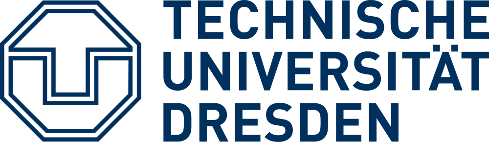

# Le Quoc Do 
Principal research engineer at Huawei Munich Research Center  
<!-- Co-founder of <a href="https://scontain.com/" target="_blank">Scontain</a> GmbH   -->
Munich, Germany  

<!-- <em>Curriculum Vitae: </em><a href="/files/CV_new.pdf" target="_blank">PDF</a>  <small>(September, 2017)</small>   -->
<em>Git repository: </em> 
<!--<em>Email: </em><a href="mailto:do@scontain.com">do@scontain.com</a>   -->
<em>Email: </em><a href="mailto:lequocdo@gmail.com">lequocdo@gmail.com</a>   
<!-- <em>Office: </em>Systems Engineering Chair, APB 3074  -->

<!-- 
 -->
-----

## About Me
<!--  -->

<!-- 
 -->

<!-- a class="tosu">I have successfully defended my PhD thesis!!!</a> -->

I'm a principal research engineer at Huawei Munich Research Center. Before joining Huawei, I was a co-founder of <a href="https://scontain.com/" target="_blank">Scontain</a> GmbH    which builds confidential computing services for customers. 
 
 
I obtained a PhD (Dr. -Ing.) from TU Dresden under supervision of <a href="https://tu-dresden.de/ing/informatik/sya/se/die-professur/inhaber-in" target="_blank"> Prof. Dr. Christof Fetzer</a> and <a href="http://homepages.inf.ed.ac.uk/pbhatoti" target="_blank"> Prof. Dr. Pramod Bhatotia</a> in Jan 2018. 
<!-- a Since April 2018, I have joined  <a href="http://scontain.com" target="_blank">Scontain</a> startup as a co-founder.-->
During my Ph.D., I’ve been lucky to have fruitful internship/collaboration with <a href="https://www.bell-labs.com/">Bell Labs</a>. Prior to joining TU Dresden, I received my master degree in computer science from Pohang University of Science and Technology (POSTECH), Korea in 2012 under the supervision of <a href="http://dpnm.postech.ac.kr/~jwkhong/" target="_blank">Prof. Dr. James Won-Ki Hong</a>.
 
 
My research interests encompass a wide range of topics in computer systems, such as distributed systems, data analytics systems, machine learning systems, system security, and cloud computing. Currently, I am particularly passionate about developing secure, privacy-preserving, and scalable machine learning systems using Trusted Execution Environment (TEE) technologies, including Intel SGX/TDX, AMD SEV SNP, ARM CCA, and Huawei QingTian Enclaves.

------
<em>All publications: </em> 

## Selected Publications
- **Accelerating Transfer Learning with Near-Data Computation on Cloud Object Stores**, Diana Petrescu, Arsany Guirguis, _Do Le Quoc_, Javier Picorel, Rachid Guerraoui, Florin Dinu, in proceedings of the 15th ACM Symposium on Cloud Computing(<em><a class="tosu">SoCC</a>), Redmond, WA, USA, 2024.

- **SinClave: Hardware-assisted Singletons for TEEs**, Franz Gregor, Robert Krahn,  _Do Le Quoc_, Christof Fetzer, in proceedings of the 24th International Middleware Conference (<em><a class="tosu">Middleware</a>), Bologna, Italy, 2023.

- **Avocado: A Secure In-Memory Distributed Storage System**, Maurice Bailleu, Dimitra Giantsidi, Vasilis Gavrielatos, _Do Le Quoc_, Vijay Nagarajan, Pramod Bhatotia, in proceedings of the USENIX Annual Technical Conference (<em><a class="tosu">USENIX ATC</a>), Santa Clara, CA, USA, 2021 (online).

- **Enclaves in the Clouds: Legal considerations and broader implications**, Jatinder Singh, Jennifer Cobbe, _Do Le Quoc_, Zahra Tarkhani, in <em><a class="tosu">ACM Queue</a> journal, 2021.

- **secureTF: A Secure TensorFlow Framework**, _Do Le Quoc_, Franz Gregor, Sergei Arnautov,
Roland Kunkel, Pramod Bhatotia, Christof Fetzer, in proceedings of the 21st International Middleware Conference (<em><a class="tosu">Middleware</a>), Delft, Netherlands, 2020 (online).

- **TEEMon: A continuous performance monitoring framework for TEEs**, Robert Krahn, Donald Dragoti, Franz Gregor, _Do Le Quoc_, Valerio Schiavoni, Pascal Felber, Clenimar Souza, Andrey Brito, Christof Fetzer, in proceedings of the 21st International Middleware Conference (<em><a class="tosu">Middleware</a>), Delft, Netherlands, 2020 (online).

- **A practical approach for updating an integrity-enforced operating system**, Wojciech Ozga, _Do Le Quoc_, Christof Fetzer,in proceedings of the 21st International Middleware Conference (<em><a class="tosu">Middleware</a>), Delft, Netherlands, 2020 (online).

- **Palaemon: A Managed Trusted Service for Secrets and Configuration Management**, Franz Gregor, Wojciech Ozga, Sébastien Vaucher, Rafael Pires, _Do Le Quoc_, Sergei Arnautov, André Martin, Valerio Schiavoni, Pascal Felber, and Christof Fetzer, inn proceedings of the Annual EEE/IFIP International Conference on Dependable Systems and Networks (<em><a class="tosu">DSN</a>), Valencia, Spain,
2020 (online).

- **SGX-PySpark: Secure Distributed Data Analytics**, _Do Le Quoc_, Franz Gregor, Jatinder Singh, and Christof Fetzer, in the International World Wide Web Conference (<em><a class="tosu">WWW</a>), San Francisco, CA, USA, 2019. (<a href="https://docs.microsoft.com/en-us/azure/architecture/example-scenario/confidential/data-analytics-containers-spark-kubernetes-azure-sql" target="_blank">This work now is running in production on Microsoft Azure</a>).

- **ApproxJoin: Approximate Distributed Joins**, _Do Le Quoc_, Istemi Ekin Akkus, Pramod Bhatotia, Spyros Blanas, Ruichuan Chen, Christof Fetzer, and Thorsten Strufe, in the ACM Symposium on Cloud Computing (<em><a class="tosu">SoCC</a>), Carlsbad, CA, USA, 2018.

- **ApproxIoT: Approximate Analytics for Edge Computing**, Zhenyu Wen, _Do Le Quoc_, Pramod Bhatotia, Ruichuan Chen, Myungjin Lee, in the 38th International Conference on Distributed Computing Systems (<em><a class="tosu">ICDCS</a>), Vienna, Austria, 2018.

- **StreamApprox: Approximate Computing for Stream Analytics**, _Do Le Quoc_, Ruichuan Chen, Pramod Bhatotia, Christof Fetzer, Volker Hilt, and Thorsten Strufe, in 17th International Middleware Conference (<em><a class="tosu">Middleware</a>), Las Vegas, Nevada, USA, 2017. <small><a>(This work also has been presented at Flink Forward'17 and Spark Summit Europe'17)
</a></small>.

- **PrivApprox: Privacy-Preserving Stream Analytics**, _Do Le Quoc_, Martin Beck,  Pramod Bhatotia,  Ruichuan Chen, Christof Fetzer, and Thorsten Strufe, in the USENIX Annual Technical Conference (<em><a class="tosu">USENIX ATC</a>), Santa Clara, CA, USA, 2017.

- **IncApprox: A Data Analytics System for Incremental Approximate Computing**, Dhanya R Krishnan, _Do Le Quoc_, Pramod Bhatotia, Christof Fetzer, and Rodrigo Rodrigue, in the 25th International World Wide Web Conference (<em><a class="tosu">WWW</a>), Montreal, Canada, 2016.

<!-- -----

## News

<table style="white-space: nowrap;">
	<tr>
	<td width="75"><b>Sep, 17'</b></td>
	<td>Giving a talk at <a href="https://berlin.flink-forward.org" target="_blank">Flink Forward, Berlin 2017</a></td>
	</tr>

	<tr>
	<td><b>August, 17'</b></td>
	<td>StreamApprox is accepted at <a href="http://2017.middleware-conference.org/" target="_blank">Middleware'17</a></td>
	</tr>

</table> -->
